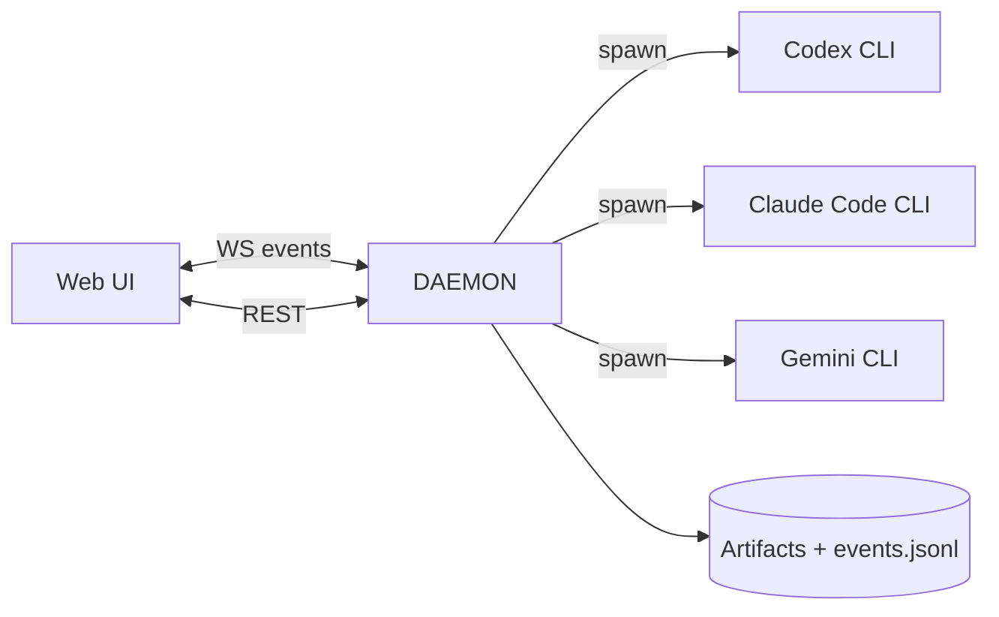

# Architecture

v0 is split into:

1. **Daemon (control plane)**
2. **Provider adapters (execution plane)**
3. **UI (observability plane)**

## Components

### Daemon

- REST API for run creation + inspection
- WebSocket for live event streaming
- Orchestrator engine (planning, scheduling, looping)
- Workspace manager (shared, copy, or git worktree)
- Verifier (runs deterministic commands)

### Provider adapters

Each adapter:

- checks provider availability
- spawns the provider harness (CLI)
- translates raw output to canonical vuhlp events
- writes raw logs/artifacts for auditability

### UI

- Graph view (nodes + edges)
- Node inspector:
  - inputs
  - logs
  - artifacts
  - “reasoning summary” (when available)
- Run controls:
  - start/stop
  - retry a node (v0: minimal)
  - export run (v0: stubbed in docs)

## Data flow

## Design goals

- Local-first (no server required)
- Use provider harnesses “as-is”
- Canonical event model for visualization
- Deterministic verification loop
- Safe-by-default permissions (no yolo unless opted-in)

## Known gaps (v0)

- Provider output parsing is best-effort and will vary by installed version.
- No first-class remote execution / multi-user collaboration.
- Multi-orchestrator nesting exists as a data model concept; v0 mainly runs a single root orchestrator per run.
