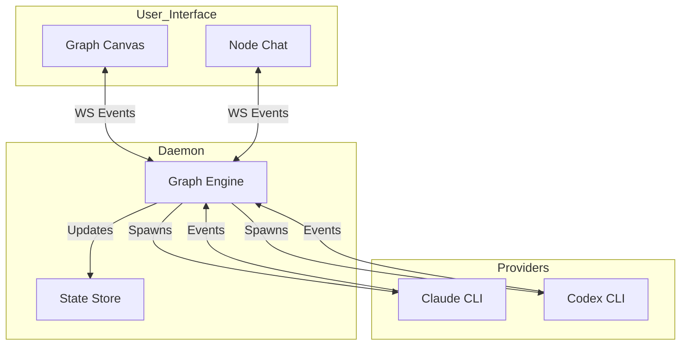

# Architecture

v0 is composed of three main layers:

1. **Daemon (Control Plane)**: The core engine that manages the graph state, data flow, and node life-cycles.
2. **Provider Adapters (Execution Plane)**: The translation layer that interfaces with external AI agents and tool interfaces.
3. **UI (Observability & Interaction)**: The frontend for building graphs, chatting with agents, and monitoring progress.

## Components

### Daemon

- **Graph Engine**: Responisble for instantiating nodes, managing connections, and routing data/events between nodes based on the graph topology.
- **Role Registry**: Manages the available templates (instructions/capabilities) that can be assigned to nodes.
- **Workspace Manager**: Controls access to the file system, handling Worktrees or Shared Workspace modes.
- **API/WebSocket**: Exposes real-time state and control endpoints to the UI.

### Provider Adapters

Adapters isolate the specific implementation details of different AI tools. Each adapter:
- Launches the provider process (e.g., spawning a CLI).
- Normalizes output streams into canonical vuhlp events.
- Captures raw logs and artifacts for auditing.

### UI

- **Graph Canvas**: A drag-and-drop interface for creating nodes and wiring them together.
- **Node Window**: A unified interface for each agent, featuring:
  - **Chat Area**: For direct interaction.
  - **Config Panel**: For setting Roles, Modes, and Instructions.
  - **Inspector**: For viewing internal state, logs, and artifacts.
- **Global Toolbar**: Controls for system-wide settings like the "Planning / Implementation" mode toggle.

## Data Flow



## Monorepo Structure

vuhlp is organized as a pnpm monorepo:

```
vuhlp-code/
├── apps/
│   └── daemon/              # Main vuhlp daemon (control plane)
│       ├── src/
│       │   ├── core/        # Graph engine, scheduler, store, types
│       │   ├── providers/   # Provider adapters (Claude, Codex, Gemini)
│       │   └── index.ts     # HTTP/WebSocket server entry
│       ├── client/          # Embedded web UI (React)
│       └── vuhlp.config.json
│
├── packages/
│   ├── ui/                  # Shared UI components
│   │   ├── brutalist-ui/    # Brutalist design system
│   │   └── sleek-ui/        # Alternative sleek design
│   ├── cli/                 # (Planned) Standalone CLI tool
│   └── backend-py/          # (Experimental) Python backend utilities
│
├── docs/                    # Documentation (this folder)
│   ├── schemas/             # JSON schemas
│   └── examples/            # Example configs and prompts
│
└── sandbox/                 # Test workspace for development
```

### Package Descriptions

| Package | Status | Description |
|---------|--------|-------------|
| `apps/daemon` | **Active** | Main vuhlp daemon with HTTP/WS server, graph engine, and embedded UI |
| `packages/ui` | **Active** | Shared React UI components (GraphPane, NodeWindow, Inspector) |
| `packages/cli` | Planned | Standalone CLI for headless vuhlp operations |
| `packages/backend-py` | Experimental | Python utilities for backend integrations |

### Key Source Directories

**`apps/daemon/src/core/`** — The heart of vuhlp:
- `orchestrator.ts` — Main orchestration loop and phase management
- `nodeExecutor.ts` — Provider process spawning and turn execution
- `graphScheduler.ts` — Concurrency control and node scheduling
- `eventBus.ts` — Event publishing and state broadcasting
- `store.ts` — Event-sourced state persistence
- `types.ts` — Canonical type definitions
- `promptFactory.ts` — Prompt construction with context packs

**`apps/daemon/src/providers/`** — Provider adapters:
- `claudeCli.ts` — Claude Code CLI adapter
- `codexCli.ts` — OpenAI Codex CLI adapter
- `geminiCli.ts` — Google Gemini CLI adapter
- `mock.ts` — Mock provider for testing
- `mappers/` — Event normalization for each provider

## Design Principles

- **Graph-First Orchestration**: The system behavior is defined by the topology of the graph, not a hardcoded state machine.
- **Hybrid Autonomy**: Every node can independently be set to "Auto" (autonomous loop) or "Interactive" (human-driven), allowing for granular human-in-the-loop control.
- **Safety by Design**: Global modes (Planning vs. Implementation) constrain agent capabilities to prevent accidental destructive changes during exploration phases.
