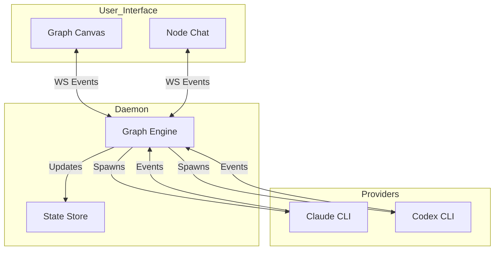

# Architecture

v0 is composed of three main layers:

1. **Daemon (Control Plane)**: The core engine that manages the graph state, data flow, and node life-cycles.
2. **Provider Adapters (Execution Plane)**: The translation layer that interfaces with external AI agents and tool interfaces.
3. **UI (Observability & Interaction)**: The frontend for building graphs, chatting with agents, and monitoring progress.

## Components

### Daemon

- **Graph Engine**: Responisble for instantiating nodes, managing connections, and routing data/events between nodes based on the graph topology.
- **Role Registry**: Manages the available templates (instructions/capabilities) that can be assigned to nodes.
- **Workspace Manager**: Controls access to the file system, handling Worktrees or Shared Workspace modes.
- **API/WebSocket**: Exposes real-time state and control endpoints to the UI.

### Provider Adapters

Adapters isolate the specific implementation details of different AI tools. Each adapter:
- Launches the provider process (e.g., spawning a CLI).
- Normalizes output streams into canonical vuhlp events.
- Captures raw logs and artifacts for auditing.

### UI

- **Graph Canvas**: A drag-and-drop interface for creating nodes and wiring them together.
- **Node Window**: A unified interface for each agent, featuring:
  - **Chat Area**: For direct interaction.
  - **Config Panel**: For setting Roles, Modes, and Instructions.
  - **Inspector**: For viewing internal state, logs, and artifacts.
- **Global Toolbar**: Controls for system-wide settings like the "Planning / Implementation" mode toggle.

## Data Flow

## Design Principles

- **Graph-First Orchestration**: The system behavior is defined by the topology of the graph, not a hardcoded state machine.
- **Hybrid Autonomy**: Every node can independently be set to "Auto" (autonomous loop) or "Interactive" (human-driven), allowing for granular human-in-the-loop control.
- **Safety by Design**: Global modes (Planning vs. Implementation) constrain agent capabilities to prevent accidental destructive changes during exploration phases.
