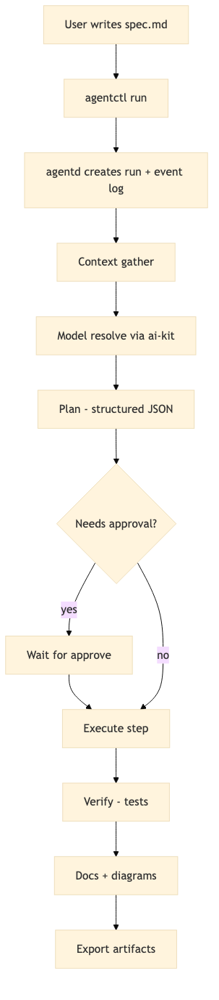

# Architecture

## High-level

The harness is split into two binaries:

- **agentd**: a local daemon that runs jobs and exposes an HTTP API + dashboard
- **agentctl**: a CLI client that creates specs, starts runs, and streams events

This separation enables:
- **local-first execution** (tools run on the machine that owns the repo)
- **remote cockpit** (another device can observe/approve via an authenticated API)



## Run lifecycle

1. **Create run**: `POST /v1/runs` (spec path + workspace path)
2. **Run coordinator** starts an agent runner goroutine
3. Runner emits **events** to:
   - an append-only NDJSON log on disk
   - in-memory subscribers (SSE)
4. When a gated step is reached, the run transitions to `waiting_approval`
5. Approval triggers the runner to continue
6. Final state is persisted (`succeeded`, `failed`, or `canceled`)

## Persistence model

Under `HARNESS_DATA_DIR` (default `~/.agent-harness`):

```
runs/<run_id>/
  run.json
  events.ndjson
  artifacts/
    <step_id>/
      ...
```

Events are immutable; `run.json` is updated as state changes.

## Agent execution model

The agent is step-based:

- **ingest**: load spec + repo instructions (`AGENTS.md`)
- **context**: gather repo map + relevant files
- **plan**: ask the model for a structured plan (JSON)
- **execute**: run steps (edits/commands/diagrams) with approvals
- **verify**: run test commands
- **document**: update docs + diagram exports

The implementation is conservative by design:
- it avoids running arbitrary commands without approval
- it records everything in an auditable event log

## ai-kit integration

The harness expects an ai-kit that provides:
- provider initialization
- model registry + model resolution
- generate + streaming generate
- optional vision/audio/image generation flows

See `docs/ai-kit-integration.md`.
