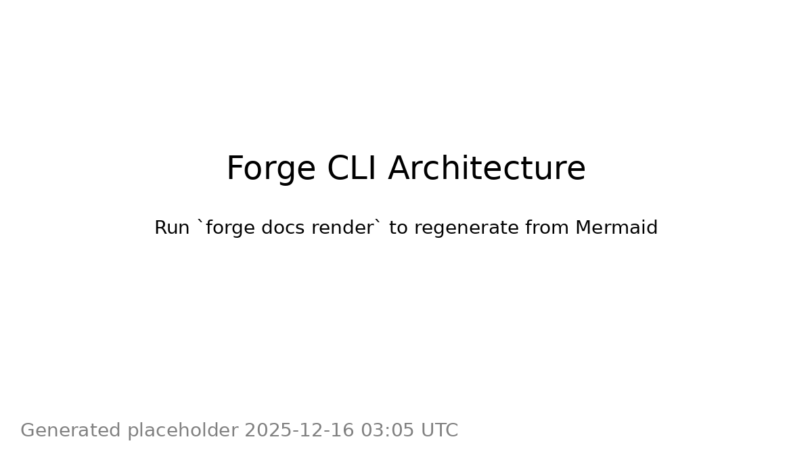
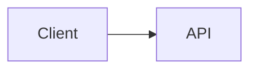

# Design Doc: Forge CLI — Terminal-Based Agentic Coding Harness (Go)

**Status:** Draft (v1)  
**Last updated:** 2025-12-16  
**Primary audience:** Engineers building fullstack apps in a pnpm monorepo with docs-as-contract rules.

## 1. Summary

Forge CLI is a **terminal-based, agentic coding tool** implemented in **Go** that orchestrates an LLM inside a strict harness:

- **Docs-as-contract**: `/docs` + package `README.md` are authoritative; code changes must not deviate.
- **pnpm monorepo aware**: context is scoped to the target package(s) and direct deps.
- **Reviewable patches**: model outputs unified diffs; Forge applies them transactionally.
- **Deterministic verification**: Forge runs your repo commands (`pnpm -r lint/test/typecheck`, infra synth, docs render/check).
- **AWS serverless**: infra checks and scaffolding align with AWS-first serverless patterns.
- **Env sync gate**: `.env.prod` is synced via `pnpm sync:prod` and enforced in CI.

Forge is not “an editor.” It’s a **harness** that can edit code safely and repeatably from the terminal, while remaining compatible with any editor (VS Code, Vim, Cursor, etc).

## 2. Problem statement

Generic IDE agents are optimized for *general usefulness*, not for enforcing your team’s conventions:

- They don’t reliably treat specs as hard constraints.
- They often over-read or under-read context (repo wandering).
- They apply changes without strong verification loops.
- They can’t easily enforce policies like “`.env.prod` changes must be synced with `pnpm sync:prod`”.

Forge’s goal is to turn LLM assistance into a **production-grade workflow**: plan, patch, verify, record.

## 3. Goals and non-goals

### 3.1 Goals

1. **Docs-as-contract** enforcement.
2. **Scoped context** for pnpm monorepos.
3. **Diff-only** edits with transactional apply/rollback.
4. **CI-compatible** policy checks and deterministic verification commands.
5. **Safe secrets posture**: never read or send `.env*` contents.
6. **Infra integration**: pluggable support for AWS IaC tools; **default preset: CDK v2**.

### 3.2 Non-goals

- A full TUI or GUI code editor replacement.
- Replacing your existing scripts (Forge calls them; doesn’t own them).
- Perfect semantic correctness (Forge enforces process and checks; humans still review).

## 4. Key repo constraints Forge is designed for

When building a fullstack product/app:

- Use **pnpm monorepo**.
- Each package has a `README.md`.
- There is a central `/docs` folder with product specs + implementation docs.
- Docs contain Mermaid diagrams, rendered to **PNG** and embedded.
- Code must not deviate from docs.
- Infra is deployed to **AWS**, typically serverless.
- Env files exist: `.env.local`, `.env.test`, `.env.prod`  
  Only `.env.prod` must be synced, using `pnpm sync:prod`.

## 5. User experience

### 5.1 Typical run

```bash
forge run --goal "Add passwordless login" --package web
```

In `review` mode (default), Forge will:

1. Build context from docs + relevant code (redacted).
2. Ask the model for a **Plan** (strict JSON).
3. Ask the model for a **Patch** (unified diff only).
4. Show the diff and ask for approval.
5. Apply patch transactionally.
6. Run verification commands.
7. Record artifacts and output a PR-style summary.

### 5.2 Commands overview

- `forge init` — create config and optional hooks.
- `forge run` — plan → patch → verify loop.
- `forge verify` — run policy checks + verification pipeline (no LLM).
- `forge docs render` — render Mermaid → PNG using repo command.
- `forge docs check` — validate docs/diagram invariants.
- `forge env status` — detect `.env.prod` drift since last sync.
- `forge env sync prod` — run `pnpm sync:prod` and update sync marker.
- `forge infra synth` — run IaC synth/package step, if configured.

## 6. Architecture

### 6.1 High-level diagram

<!-- diagram: docs/assets/diagrams/forge-architecture.png -->
```mermaid
flowchart TB
  U[User] --> CLI[Forge CLI (Go)]
  CLI --> RS[Repo Scanner]
  CLI --> DI[Docs Indexer]
  CLI --> PE[Policy Engine]
  CLI --> CB[Context Builder]
  CLI --> LLM[LLM Provider]
  CLI --> PX[Patch Engine]
  CLI --> RUN[Runner]
  CLI --> REC[Recorder]

  RS --> CB
  DI --> CB
  PE --> CB
  CB --> LLM
  LLM --> PX
  PX --> RUN
  RUN --> PE
  RUN --> REC
  PX --> REC
  CB --> REC
```



### 6.2 Components

- **CLI**: argument parsing, interactive UX, output formatting.
- **Repo Scanner**: detects workspace packages, scripts, dependency info, changed files.
- **Docs Indexer**: loads `/docs/**/*.md` and package READMEs; provides doc inference.
- **Policy Engine**: enforces rules (docs-as-contract, forbidden paths, README required, env sync).
- **Context Builder**: selects file snippets for LLM with size limits + redaction.
- **LLM Provider**: abstraction over model providers; emits plan/patch/verify outputs.
- **Patch Engine**: validates diff, applies transactionally, rollbacks on failure.
- **Runner**: runs shell commands (pnpm scripts, synth), captures logs.
- **Recorder**: stores run artifacts to `.forge/runs/<timestamp>/`.

## 7. Infra integration: “best” default and pluggability

### 7.1 Recommendation

Forge should ship with a **default preset for AWS CDK v2** because it is a stable baseline for AWS-first teams. However, Forge must remain tool-agnostic.

### 7.2 InfraProvider interface

Forge supports multiple IaC tools via a provider interface:

```go
type InfraProvider interface {
  Name() string
  Detect(repoRoot string) (bool, error)
  Synth(ctx context.Context) error
  Diff(ctx context.Context) error // optional
}
```

### 7.3 Detection heuristics (examples)

- **CDK**: `cdk.json`, `aws-cdk-lib` in dependencies, `infra/` folder.
- **SST**: `sst.config.ts`.
- **Serverless Framework**: `serverless.yml`.

Forge should let the repo override detection with config.

## 8. Git behavior: support both workflows

Forge supports multiple git modes (both local iteration and “agent branch” workflows):

### 8.1 Modes

- `worktree`: apply changes to current working tree, no commits.
- `branch`: create new branch at start; commit at end (or per iteration).
- `commit`: stay on current branch but commit automatically.

### 8.2 Recommended defaults

- `forge run` (review mode): `worktree`
- `forge run --mode=auto`: `branch` (safer audit trail)

### 8.3 Transaction/rollback behavior

Forge records:
- starting `HEAD` SHA
- clean/dirty status
- file list changed

On failure it reverts to the pre-run git state (or aborts cleanly if it can’t).

## 9. Docs/spec mapping: inferred (default)

Forge does **not** require a manual `docs/index.yaml`. Instead, it infers relevant docs.

### 9.1 Inference algorithm (MVP)

Inputs:
- goal string
- target package name
- repo structure
- `git diff --name-only` (if working on existing changes)

Method:
1. Always include:
   - target package `README.md`
   - any top-level docs marked as foundational (configurable: e.g., `docs/product-spec.md`, `docs/architecture.md`)
2. Score `/docs/**/*.md` candidates by:
   - keyword overlap with goal
   - package name and path matches
   - heading matches weighted higher than body text
3. Select top N docs (default 3–7) and top sections per doc.
4. Emit an inference report to artifacts:
   - selected docs
   - confidence scores
   - why each doc was chosen

### 9.2 Enforcement

Even with inference, Forge requires the model plan to include **doc citations** (`path + heading`) and fails in CI if citations are missing or low-confidence (configurable).

## 10. Env sync integration (`.env.prod` → secrets)

### 10.1 Requirements

- `.env.prod` must be synced using `pnpm sync:prod`.
- `.env.local` / `.env.test` are not synced (no gating).
- Forge must never print or transmit env values.

### 10.2 Implementation approach

- Keep a sync marker: `.forge/state/env_prod.sha256`
- `forge env status` compares hash of `.env.prod` to marker
- `forge env sync prod` runs `pnpm sync:prod`, then updates marker on success
- `forge verify --mode=ci` fails if:
  - `.env.prod` changed and marker is stale
  - unless policy override is explicitly enabled

## 11. Docs diagrams: Mermaid → PNG

Forge enforces a consistent docs pipeline:

- `forge docs render` calls a repo-defined renderer command (recommended).
- `forge docs check` verifies:
  - Mermaid blocks are renderable
  - referenced PNGs exist and are up to date (best effort)

Recommended doc convention:

```md
<!-- diagram: docs/assets/diagrams/auth-flow.png -->

```

## 12. LLM interaction model (Plan / Patch / Verify)

Forge uses three LLM “roles”:

- **Plan**: produce strict JSON plan (schema-validated) with doc citations.
- **Patch**: produce unified diff only (no commentary).
- **Verify**: compare patch vs docs + policies; produce strict JSON report.

Schemas live in:
- `schemas/plan.schema.json`
- `schemas/verify.schema.json`

Prompts live in:
- `prompts/plan_system.md`
- `prompts/patch_system.md`
- `prompts/verify_system.md`

## 13. Policy checks (CI)

See: `ci/policy-checks.md`.

At minimum, CI should run:

- `forge verify --mode=ci`

This should enforce:
- README per package
- docs diagram hygiene (if enabled)
- `.env.prod` sync gate
- lint/typecheck/test
- infra synth if infra touched

## 14. Artifact recording

Forge writes artifacts to `.forge/runs/<timestamp>/`:

- `context_manifest.json` (paths included/excluded; no secret contents)
- `plan.json`
- `patch.diff`
- `verify.json` (if verifier pass enabled)
- `commands.log`
- `summary.md`

## 15. Security considerations

- Denylist paths: `.env*`, keys, certs, `**/secrets/**`
- Redaction patterns for common tokens
- Never send secret file contents to LLM
- Avoid uploading large binaries (PNGs, build artifacts)

## 16. Implementation plan

### MVP
- `init`, `run`, `verify`
- plan/patch loop with schema validation + diff-only
- env sync marker + gate
- basic docs inference
- artifact recording

### v1
- docs render/check integration
- infra provider detection + synth integration
- verifier pass and richer policy checks
- better context slicing + token budgeting

