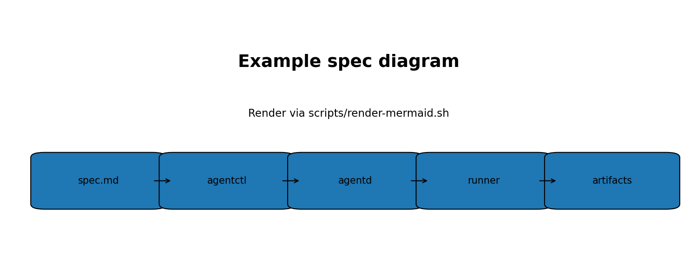

# Goal

Add a `GET /hello` endpoint to `agentd` that returns:

```json
{"message":"hello"}
```

# Constraints / nuances

- Keep backwards compatibility with existing API routes.
- Include a unit test for the handler.
- Update docs if needed.

# Acceptance tests

- `curl http://127.0.0.1:8787/hello` returns the JSON above and `200`.
- `go test ./...` passes.

# Notes

Embed diagrams as PNGs in docs:


